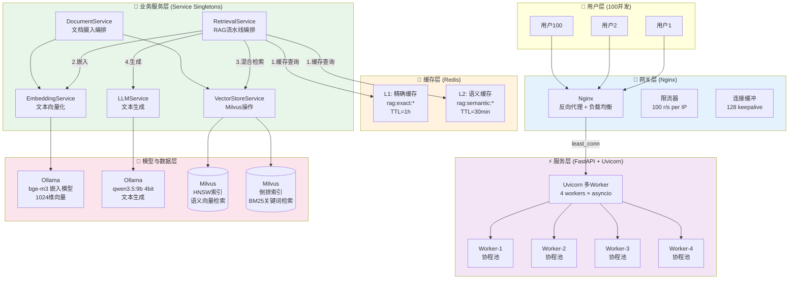
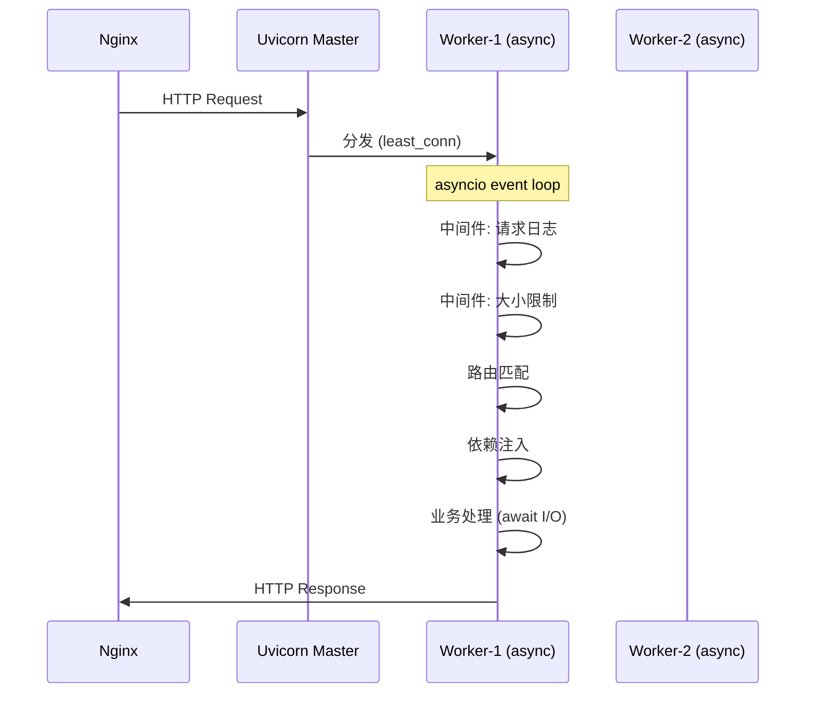
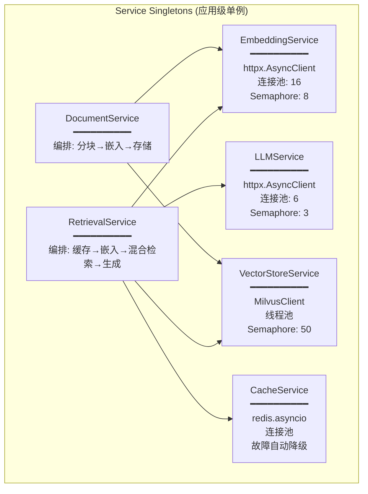
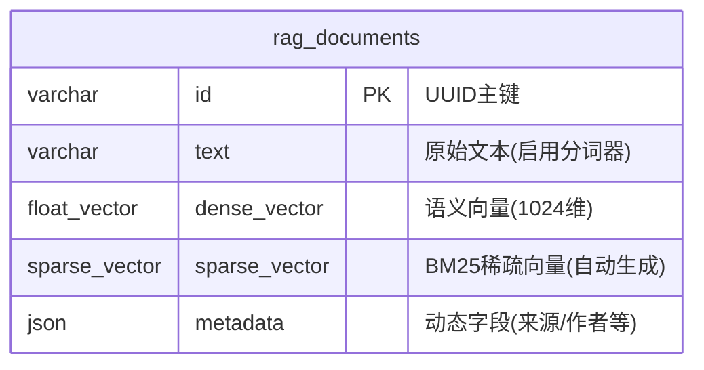
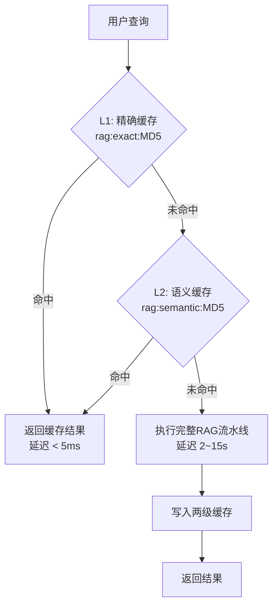
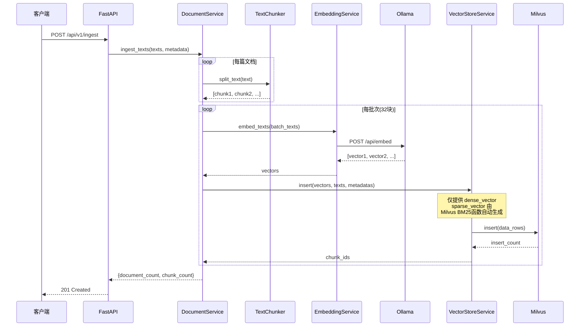
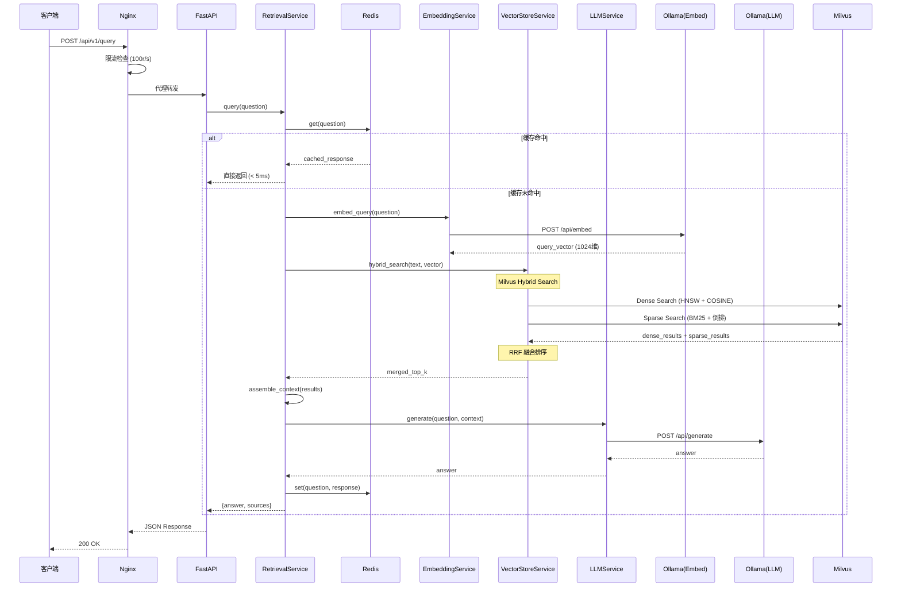

# AsyncRAGSystem 架构设计文档

> 版本: 0.2.0 | 更新日期: 2026-07-17
> 设计目标: 支持100人异步并发的 RAG 检索增强生成系统

---

## 目录

1. [总体架构概览](#1-总体架构概览)
2. [分层架构详解](#2-分层架构详解)
   - [2.1 网关层 (Nginx)](#21-网关层-nginx)
   - [2.2 服务层 (FastAPI + Uvicorn)](#22-服务层-fastapi--uvicorn)
   - [2.3 业务服务层](#23-业务服务层)
   - [2.4 数据与模型层](#24-数据与模型层)
   - [2.5 缓存层 (Redis)](#25-缓存层-redis)
3. [核心数据流](#3-核心数据流)
   - [3.1 文档摄入流](#31-文档摄入流)
   - [3.2 RAG问答流](#32-rag问答流)
   - [3.3 缓存命中流](#33-缓存命中流)
4. [关键设计决策](#4-关键设计决策)
5. [并发策略](#5-并发策略)
6. [扩展性设计](#6-扩展性设计)

---

## 1. 总体架构概览



### 架构分层一览

| 层级 | 组件 | 核心职责 | 并发策略 |
|------|------|---------|---------|
| **网关层** | Nginx | 反向代理、负载均衡、限流、连接缓冲 | `least_conn` + `limit_req` |
| **服务层** | FastAPI + Uvicorn | HTTP处理、路由分发、请求校验 | 4 workers × asyncio协程池 |
| **缓存层** | Redis | L1精确缓存 + L2语义缓存 | 异步连接池 + 故障降级 |
| **业务层** | Service Singletons | RAG流水线编排、文档处理 | Semaphore 并发控制 |
| **模型层** | Ollama (GPU) | 文本嵌入 + LLM生成 | Semaphore(3~8) 排队 |
| **数据层** | Milvus | 向量存储 + BM25关键词检索 | Semaphore(50) + 线程池 |

---

## 2. 分层架构详解

### 2.1 网关层 (Nginx)

```
                    ┌─────────────────────────────┐
                    │         Nginx Gateway        │
                    │                              │
   Client ─────────▶│  ┌───────────────────────┐   │
                    │  │   Rate Limiter         │   │
                    │  │   100 r/s per IP       │   │
                    │  └───────────┬───────────┘   │
                    │              │               │
                    │  ┌───────────▼───────────┐   │
                    │  │   Load Balancer        │   │
                    │  │   least_conn 算法      │   │
                    │  └───┬───────┬───────┬───┘   │
                    │      │       │       │       │
                    │      ▼       ▼       ▼       │
                    │  FastAPI FastAPI FastAPI     │
                    └─────────────────────────────┘
```

#### 设计决策

| 决策项 | 选择 | 原因 |
|--------|------|------|
| **负载均衡算法** | `least_conn` | LLM请求耗时长(10s+)，最少连接数避免请求堆积 |
| **限流策略** | 100 r/s + burst=20 | 保护后端LLM（12GB显存仅支持串行推理） |
| **连接缓冲** | `proxy_buffering off` (SSE) | SSE流式响应需要实时推送，不能缓冲 |
| **超时配置** | read=180s, send=180s | LLM最长生成时间约120s，留60s余量 |
| **Keepalive** | 128连接池 | 复用TCP连接，减少握手开销 |

#### 为什么在 FastAPI 前面加 Nginx？

1. **安全防护**: 隐藏后端服务细节，防止直接攻击 FastAPI
2. **负载均衡**: 可将流量分发到多个 FastAPI 实例（水平扩展）
3. **连接管理**: 慢客户端连接缓冲，释放 FastAPI worker 资源
4. **静态资源**: 可托管前端 SPA（未来扩展）
5. **SSL终止**: 集中管理 HTTPS 证书（生产环境）

---

### 2.2 服务层 (FastAPI + Uvicorn)



#### 设计决策

| 决策项 | 选择 | 原因 |
|--------|------|------|
| **框架** | FastAPI | 原生 async/await，自动 OpenAPI 文档，Pydantic 校验 |
| **服务器** | Uvicorn | 最快的 ASGI 服务器之一，支持多 worker |
| **Worker数** | 4 | CPU密集型操作少（全I/O），4 worker 充分利用 64GB RAM |
| **并发模型** | async/await 协程 | I/O密集型（Ollama/Milvus/Redis全是网络I/O） |
| **中间件** | CORS + 请求日志 + 大小限制 | 安全、可观测、防OOM |

#### 为什么用 4 个 Worker 而不是更多？

```
Worker 数量 = min(CPU核心数 × 2, RAM容量 / 每Worker内存)

64GB RAM / ~8GB per worker (含Python进程+连接池) ≈ 8 workers max
但考虑到:
  - 真正的计算瓶颈在 Ollama GPU（串行），不在 CPU
  - 每个 worker 内部用 asyncio 协程处理 I/O 并发
  - 过多 worker 增加上下文切换开销，不会提升吞吐
  
因此 4 workers 是最优平衡点。
```

---

### 2.3 业务服务层



#### 服务设计原则

| 原则 | 实现方式 | 好处 |
|------|---------|------|
| **单一职责** | 每个 Service 只做一件事 | 易测试、易替换、易扩展 |
| **依赖注入** | FastAPI `Depends()` 注入单例 | 解耦、便于单元测试 mock |
| **连接池复用** | httpx.AsyncClient / MilvusClient 全局单例 | 避免频繁建连，支撑高并发 |
| **并发控制** | asyncio.Semaphore 限流 | 防止下游服务过载 |
| **优雅降级** | Redis不可用→跳过缓存；BM25不可用→纯语义检索 | 部分故障不影响核心功能 |

#### RetrievalService 流水线设计

```
用户问题
   │
   ▼
┌──────────────────────┐
│ Step 0: 缓存检查      │  ← Redis L1(精确) → L2(语义)
│ 命中? → 直接返回 ✅   │     命中率预估: 20~40%
└────────┬─────────────┘
         │ 未命中
         ▼
┌──────────────────────┐
│ Step 1: 查询嵌入      │  ← Ollama bge-m3
│ 文本 → 1024维向量    │     耗时: ~200ms
└────────┬─────────────┘
         │
         ▼
┌──────────────────────┐
│ Step 2: 混合检索      │  ← Milvus Hybrid Search
│ BM25 + Dense → RRF   │     耗时: ~20ms
│ 融合排名              │
└────────┬─────────────┘
         │
         ▼
┌──────────────────────┐
│ Step 3: 上下文构建    │  去重 + 拼接 + 截断
│ [片段1]...[片段N]     │
└────────┬─────────────┘
         │
         ▼
┌──────────────────────┐
│ Step 4: LLM 生成     │  ← Ollama qwen3.5:9b
│ RAG提示词 → 回答     │     耗时: 2~15s
└────────┬─────────────┘
         │
         ▼
┌──────────────────────┐
│ Step 5: 结果缓存      │  → Redis (两级写入)
│ 供后续查询复用        │
└──────────────────────┘
```

---

### 2.4 数据与模型层

#### 2.4.1 Milvus Collection Schema (含 BM25)



| 字段 | 类型 | 说明 | 索引 |
|------|------|------|------|
| `id` | VARCHAR(64) | UUID主键 | Primary Key |
| `text` | VARCHAR(65535) | 原始文本，`enable_analyzer=True` | - |
| `dense_vector` | FLOAT_VECTOR(1024) | Ollama bge-m3 生成的语义向量 | **HNSW** (COSINE) |
| `sparse_vector` | SPARSE_FLOAT_VECTOR | Milvus BM25函数自动生成的稀疏向量 | **SPARSE_INVERTED_INDEX** (BM25) |

#### 2.4.2 混合检索策略

```
查询文本: "什么是RAG系统的检索增强生成原理？"
         │
         ├──────────────────┬──────────────────────┐
         ▼                  ▼                      │
   ┌──────────┐      ┌──────────────┐             │
   │ Dense    │      │ Sparse (BM25)│             │
   │ 语义检索  │      │ 关键词检索    │             │
   │          │      │              │             │
   │ bge-m3   │      │ Milvus 内置   │             │
   │ 1024维   │      │ BM25 分词器   │             │
   │ COSINE   │      │ 倒排索引      │             │
   └────┬─────┘      └──────┬───────┘             │
        │ Top-10            │ Top-10              │
        ▼                   ▼                      │
   ┌─────────────────────────────────────┐        │
   │         RRF 融合排序器               │        │
   │                                     │        │
   │  RRF_score(d) = Σ 1/(k + rank_i(d))│        │
   │                                     │        │
   │  k = 60 (经验最优值)                │        │
   └────────────────┬────────────────────┘        │
                    │                              │
                    ▼                              │
            ┌──────────────┐                      │
            │  Top-5 结果   │ ◄────────────────────┘
            │  (融合排序)   │
            └──────────────┘
```

#### 为什么使用混合检索？

| 检索方式 | 优势 | 劣势 | 适用场景 |
|---------|------|------|---------|
| **语义检索 (Dense)** | 理解同义词、语义相似性 | 对专有名词/编号不敏感 | "如何提高系统性能？" |
| **BM25 关键词 (Sparse)** | 精确匹配专有名词、IDF加权 | 无法理解语义改写 | "API-2024 的错误码 E5001" |
| **混合检索 (Hybrid)** | **两者互补，召回率更高** | 略微增加检索延迟 | 通用场景 ✅ |

#### 为什么使用 RRF 融合而非加权分数融合？

1. **无需分数归一化**: Dense COSINE 分数 [0,1] 和 BM25 分数范围不同，直接加权需要归一化
2. **排名鲁棒性**: RRF 基于排名而非绝对分数，对异常值不敏感
3. **实践验证**: 学术界和工业界广泛使用 RRF (k=60)
4. **参数少**: 只需调一个 k 参数，而加权融合需要调两个权重

---

### 2.5 缓存层 (Redis)



#### 缓存Key设计

| 缓存级别 | Key格式 | 示例 | TTL | 用途 |
|---------|---------|------|-----|------|
| **L1 精确** | `rag:exact:{md5(原始问题)}` | `rag:exact:a1b2c3...` | 1小时 | 完全相同的重复查询 |
| **L2 语义** | `rag:semantic:{md5(归一化问题)}` | `rag:semantic:d4e5f6...` | 30分钟 | 同义改写查询 |

#### 语义归一化处理

```python
原始:  "什么是 RAG 系统？？它的原理是什么？"
归一化: "什么是 rag 系统 它的原理是什么"
# 步骤: 小写 → 去标点 → 合并空白

原始:  "What's Retrieval-Augmented Generation?"
归一化: "whats retrieval augmented generation"
```

#### 为什么设计两级缓存而不是单一缓存？

1. **L1 精确缓存**: 
   - 命中率高（热门问题重复询问）
   - 不会误匹配（MD5完全相同才命中）
   - TTL长（1小时），因为精确查询的价值大

2. **L2 语义缓存**:
   - 覆盖同义改写场景（"什么是RAG" ≈ "啥是RAG"）
   - 归一化降低误匹配风险
   - TTL短（30分钟），因为归一化可能过度泛化

3. **为什么不使用向量相似度缓存？**
   - 需要额外的嵌入计算（抵消缓存收益）
   - 需要 Redis Stack（RediSearch模块）
   - 当前归一化方案在实践中已足够有效

#### Redis 故障降级策略

```python
# 连接失败 → 自动禁用缓存 → 直接执行RAG流水线
# 运行时断开 → 捕获异常 → 跳过缓存读写
# 永远不因 Redis 故障而影响核心问答功能
```

---

## 3. 核心数据流

### 3.1 文档摄入流



### 3.2 RAG问答流 (完整链路)



### 3.3 缓存命中流 (性能对比)

```
场景A: 首次查询 (缓存未命中)
  ┌──────┐    ┌──────┐    ┌──────┐    ┌──────┐    ┌──────┐
  │ 嵌入  │───▶│ 检索  │───▶│ 生成  │───▶│ 缓存  │───▶│ 返回  │
  │200ms │    │ 20ms │    │ 5s   │    │ 5ms  │    │      │
  └──────┘    └──────┘    └──────┘    └──────┘    └──────┘
  总耗时: ~5.2s

场景B: 重复查询 (L1精确缓存命中)
  ┌──────┐    ┌──────┐
  │ 查缓存│───▶│ 返回  │
  │ <5ms │    │      │
  └──────┘    └──────┘
  总耗时: <5ms (提升 1000×)

场景C: 同义改写查询 (L2语义缓存命中)
  ┌──────┐    ┌──────┐    ┌──────┐
  │归一化 │───▶│ 查缓存│───▶│ 返回  │
  │<1ms  │    │ <5ms │    │      │
  └──────┘    └──────┘    └──────┘
  总耗时: <6ms (提升 800×)
```

---

## 4. 关键设计决策

### 4.1 为什么选择 PyMilvus 3.0 的 MilvusClient API？

| 对比维度 | 旧 Collection API | 新 MilvusClient API |
|---------|------------------|-------------------|
| 易用性 | 需要手动管理连接 | 自动连接池 |
| BM25支持 | 不支持 | **内置 BM25 Function** |
| 混合检索 | 需客户端合并 | **服务端 hybrid_search + RRF** |
| 线程安全 | 需加锁 | 原生线程安全 |

### 4.2 为什么 BM25 在 Milvus 侧实现而非应用侧？

1. **性能**: Milvus 使用 C++ 实现的倒排索引，比 Python 的 BM25 实现快 10~100 倍
2. **一致性**: 索引和数据在同一处，避免数据同步问题
3. **混合检索**: 服务端可一次性完成 Dense + Sparse 检索并融合，减少网络往返
4. **增量更新**: 文档插入时自动更新倒排索引，无需重建

### 4.3 为什么用 RRF 而非加权融合？

```python
# 加权融合的问题:
# Dense分数范围: [0.3, 0.95] (COSINE)
# BM25分数范围: [0.1, 25.0] (词频相关)
# → 直接加权需要额外的分数归一化 → 增加复杂度和不确定性

# RRF的优势:
# 只关心排名, 不关心绝对分数值
# RRF_score(d) = Σ 1/(k + rank_i(d))
# k=60 时, rank=1 贡献 1/61, rank=100 贡献 1/160
# → 数学简洁, 无需调参, 实践效果好
```

### 4.4 为什么使用 HNSW 索引而非 IVF_FLAT？

| 索引类型 | 查询速度 | 召回率 | 内存占用 | 适合场景 |
|---------|---------|--------|---------|---------|
| IVF_FLAT | 中等(5~20ms) | 高(可调) | 低 | 百万级以上数据 |
| **HNSW** | **极快(1~5ms)** | **极高(>99%)** | 中等 | **高并发实时检索** ✅ |

对于100并发场景，HNSW 的极低查询延迟是最优选择。

---

## 5. 并发策略

### 5.1 全链路并发控制

```
                    ┌──────────────────────────────────────┐
  100 并发用户 ─────▶│              并发控制层级              │
                    ├──────────────────────────────────────┤
                    │ L1: Nginx limit_req (100 r/s + 20 burst) │
                    │ L2: Uvicorn 4 workers × asyncio          │
                    │ L3: httpx 连接池 (8~16 连接)             │
                    │ L4: Semaphore(LLM=3, Embed=8, Milvus=50) │
                    │ L5: Redis 异步连接池                      │
                    └──────────────────────────────────────┘
```

### 5.2 瓶颈分析与缓解

```
瓶颈排序: LLM生成 >> 嵌入计算 >> BM25检索 >> Dense检索 >> Redis缓存

LLM (qwen3.5:9b 4bit on RTX3060 12GB):
  - 模型权重: ~5.5GB VRAM (4bit量化)
  - KV Cache (per request): ~0.5-1GB VRAM (2048 tokens上下文)
  - 总计 3并发: ~8-9GB VRAM, 12GB显存内安全 ✅
  - 限制: 单GPU串行推理, 每次生成 2~15s
  - 缓解: Semaphore(3) 控制排队, 上下文截断30K字符, 超时120s
  - 预期: 100用户 → 部分排队等待, 但不会OOM或超时崩溃

嵌入 (bge-m3 on Ollama):
  - 模型权重: ~2GB VRAM (与LLM分时共享GPU)
  - 限制: 与LLM共享GPU资源, 嵌入时LLM暂停
  - 缓解: Semaphore(8), 批量嵌入 (一次处理多条), 嵌入速度快(~200ms)
  - 预期: 单次嵌入 ~200ms, 对LLM排队影响小

Milvus:
  - 系统内存占用: ~4-8GB RAM
  - 限制: 网络I/O + 索引查询
  - 缓解: Semaphore(50), HNSW索引极快(~5ms)
  - 预期: 轻松支撑100+并发检索

Redis:
  - 系统内存占用: ~1-2GB RAM
  - 限制: 网络I/O (极快)
  - 缓解: 异步连接池, 故障自动降级
  - 预期: 缓存命中时 < 5ms 响应

系统总内存占用 (64GB RAM):
  - 4× Python Worker:  ~8-12GB
  - Milvus Standalone:   ~4-8GB
  - Redis:              ~1-2GB
  - Ollama (系统RAM):    ~2-3GB
  - 操作系统 + 空闲:     ~39-49GB 剩余 ✅
```

### 5.3 100并发场景模拟

```
时间线 (假设100用户同时发起RAG查询):

t=0s:   100个请求到达 Nginx
        → 限流器通过 (burst=20, rate=100r/s)
        → least_conn 分发到 4 个 FastAPI Worker

t=0.01s: Worker 开始处理
        → L1/L2 缓存检查 (Redis, ~5ms)
        → 假设 25-35 个命中缓存 → 立即返回 (< 10ms)

t=0.2s:  剩余 65-75 个请求
        → 嵌入阶段: Semaphore(8) → 8个并发执行, 其余排队
        → 每批 ~200ms → 约 9-10 批 → ~1.8-2.0s 全部完成嵌入

t=0.2s:  混合检索 (与嵌入有重叠, 嵌入完一个即开始检索)
        → Milvus Semaphore(50) → 基本并发执行
        → 单次 ~20ms

t=2.0s:  请求进入 LLM 生成阶段
        → Semaphore(3) → 3个并发, 其余排队
        → 每次生成 2~15s (取决于上下文长度和生成token数)
        → 70÷3 ≈ 24 批 → 最坏情况 ~120s (受 LLM_TIMEOUT 限制)

结论: 
  - 25-35% 用户命中缓存 → 秒级响应 (< 10ms)
  - 65-75% 用户需等待 LLM → 2~120s (取决于排队位置)
  - 系统不会崩溃, LLM是明确瓶颈 ✅
  - 缓解方案: 增加GPU节点 / 使用更小的模型 / 降低 LLM_MAX_TOKENS
  - 上下文截断保护: _MAX_CONTEXT_CHARS=30000 (约15000 tokens)
```

---

## 6. 扩展性设计

### 6.1 水平扩展路径

```
当前 (单机):
  ┌──────────────────────────────────┐
  │  Nginx → FastAPI(4w) → Milvus   │
  │              ↓                   │
  │         Ollama (GPU)             │
  └──────────────────────────────────┘

扩展后 (多机):
  ┌─────────────────────────────────────────────┐
  │              Nginx (LB)                      │
  │            least_conn                        │
  │     ┌─────────┼─────────┐                   │
  │     ▼         ▼         ▼                   │
  │  FastAPI   FastAPI   FastAPI   ← 可独立扩展  │
  │  Node-1    Node-2    Node-3                 │
  │     │         │         │                   │
  │     └─────────┼─────────┘                   │
  │               ▼                             │
  │        Milvus Cluster     ← 可独立扩展       │
  │        (多节点分布式)                        │
  │               │                             │
  │        Redis Sentinel    ← 高可用            │
  │               │                             │
  │        Ollama × N GPU   ← GPU池化            │
  └─────────────────────────────────────────────┘
```

### 6.2 未来扩展方向

| 方向 | 技术方案 | 优先级 |
|------|---------|--------|
| **语义缓存升级** | Redis Stack + 向量相似度缓存 | 中 |
| **重排序** | Cross-Encoder (bge-reranker) 精排 | 高 |
| **多模态** | 支持 PDF/图片/表格文档解析 | 中 |
| **会话管理** | 多轮对话上下文维护 | 高 |
| **监控告警** | Prometheus + Grafana 全链路追踪 | 中 |
| **A/B测试** | 不同检索策略效果对比 | 低 |

---

## 附录: 部署清单

### 环境依赖

| 组件 | 版本/配置 | 端口 |
|------|----------|------|
| Python | 3.11+ | - |
| Ollama | qwen3.5:9b + bge-m3 | 11434 |
| Milvus | 2.5+ (Standalone) | 19530 |
| Redis | 7.0+ | 6379 |
| Nginx | 1.25+ | 8080 |

### 启动顺序

```bash
# 1. 启动基础服务
docker start milvus-standalone redis

# 2. 初始化 Milvus Collection (含BM25 Schema)
python scripts/init_milvus.py --reset

# 3. 启动 FastAPI
uvicorn app.main:app --host 127.0.0.1 --port 8000 --workers 4

# 4. 启动 Nginx (可选, 用于生产环境)
nginx -c /path/to/nginx/nginx.conf
```
